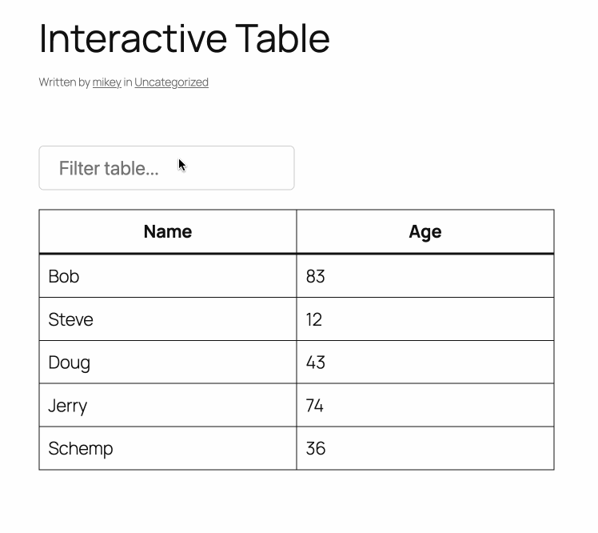

# Interactive Table

An interactive table block for WordPress that adds the ability to search and filter table rows in real time.

## Description

**Interactive Table** is a WordPress block plugin that lets you add filterable, interactive tables to your site using the block editor.

- Instantly filter table rows as you type
- Add and edit tables visually in the block editor
- Built with the WordPress Interactivity API

## Installation

1. Upload the plugin files to the `/wp-content/plugins/interactive-table` directory, or install the plugin through the WordPress plugins screen directly.
2. Activate the plugin through the 'Plugins' screen in WordPress.

## Usage

1. In the block editor, insert the **Interactive Table** block from the block inserter.
2. A default table will be added automatically.
3. Add, remove, or edit rows and columns using the standard Table block controls.
4. Use the search field above the table to filter rows instantly on the front end.

## Frequently Asked Questions

**How do I add an interactive table?**
> Insert the "Interactive Table" block from the block inserter. A default table will be added automatically.

**Can I customize the table?**
> Yes! You can add, remove, or edit rows and columns using the standard Table block controls.

## Screenshots

## Changelog

### 0.1.0
- Initial release

## Contributing

- PHP code is linted with [WordPress Coding Standards](https://github.com/WordPress/WordPress-Coding-Standards) via `phpcs.xml`.
- JavaScript/React code is linted with [@wordpress/eslint-plugin](https://github.com/WordPress/gutenberg/tree/trunk/packages/eslint-plugin) via `.eslintrc.js`.
- To run linters:
  - `vendor/bin/phpcs` for PHP
  - `npx eslint .` for JS